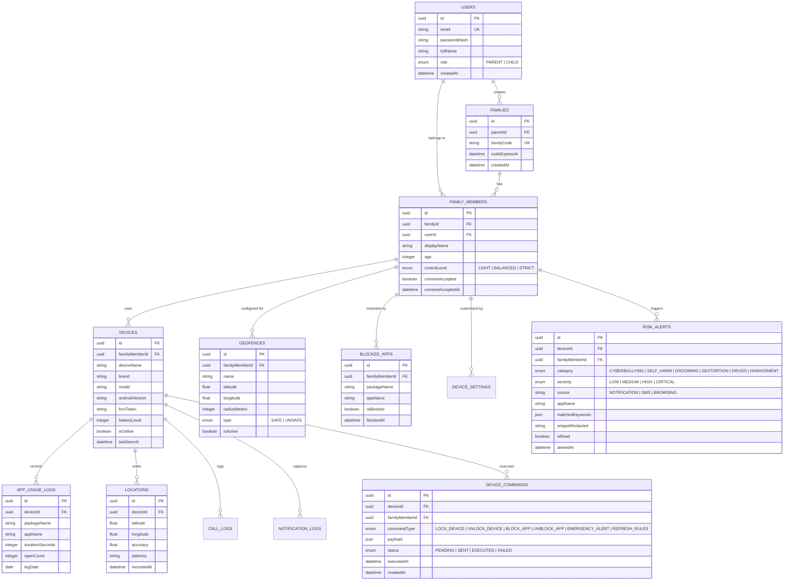

# SafeGuard Family - Database Schema & ERD

## 1. Entity Relationship Diagram (ERD)

```mermaid
erDiagram
    USERS ||--o{ FAMILIES : "creates"
    USERS ||--o{ FAMILY_MEMBERS : "belongs to"
    FAMILIES ||--o{ FAMILY_MEMBERS : "has"
    FAMILY_MEMBERS ||--o{ DEVICES : "uses"
    FAMILY_MEMBERS ||--o{ GEOFENCES : "configured for"
    FAMILY_MEMBERS ||--o{ BLOCKED_APPS : "restricted by"
    FAMILY_MEMBERS ||--o{ DEVICE_SETTINGS : "customized by"
    FAMILY_MEMBERS ||--o{ RISK_ALERTS : "triggers"
    DEVICES ||--o{ APP_USAGE_LOGS : "records"
    DEVICES ||--o{ LOCATIONS : "emits"
    DEVICES ||--o{ CALL_LOGS : "logs"
    DEVICES ||--o{ NOTIFICATION_LOGS : "captures"
    DEVICES ||--o{ DEVICE_COMMANDS : "executes"

    USERS {
        uuid id PK
        string email UK
        string passwordHash
        string fullName
        enum role "PARENT | CHILD"
        datetime createdAt
    }

    FAMILIES {
        uuid id PK
        uuid parentId FK
        string familyCode UK
        datetime codeExpiresAt
        datetime createdAt
    }

    FAMILY_MEMBERS {
        uuid id PK
        uuid familyId FK
        uuid userId FK
        string displayName
        integer age
        enum controlLevel "LIGHT | BALANCED | STRICT"
        boolean consentAccepted
        datetime consentAcceptedAt
    }

    DEVICES {
        uuid id PK
        uuid familyMemberId FK
        string deviceName
        string brand
        string model
        string androidVersion
        string fcmToken
        integer batteryLevel
        boolean isOnline
        datetime lastSeenAt
    }

    APP_USAGE_LOGS {
        uuid id PK
        uuid deviceId FK
        string packageName
        string appName
        integer durationSeconds
        integer openCount
        date logDate
    }

    LOCATIONS {
        uuid id PK
        uuid deviceId FK
        float latitude
        float longitude
        float accuracy
        string address
        datetime recordedAt
    }

    GEOFENCES {
        uuid id PK
        uuid familyMemberId FK
        string name
        float latitude
        float longitude
        integer radiusMeters
        enum type "SAFE | UNSAFE"
        boolean isActive
    }

    BLOCKED_APPS {
        uuid id PK
        uuid familyMemberId FK
        string packageName
        string appName
        boolean isBlocked
        datetime blockedAt
    }

    RISK_ALERTS {
        uuid id PK
        uuid deviceId FK
        uuid familyMemberId FK
        enum category "CYBERBULLYING | SELF_HARM | GROOMING | SEXTORTION | DRUGS | HARASSMENT"
        enum severity "LOW | MEDIUM | HIGH | CRITICAL"
        string source "NOTIFICATION | SMS | BROWSING"
        string appName
        json matchedKeywords
        string snippetRedacted
        boolean isRead
        datetime alertedAt
    }

    DEVICE_COMMANDS {
        uuid id PK
        uuid deviceId FK
        uuid familyMemberId FK
        enum commandType "LOCK_DEVICE | UNLOCK_DEVICE | BLOCK_APP | UNBLOCK_APP | EMERGENCY_ALERT | REFRESH_RULES"
        json payload
        enum status "PENDING | SENT | EXECUTED | FAILED"
        datetime executedAt
        datetime createdAt
    }
```
